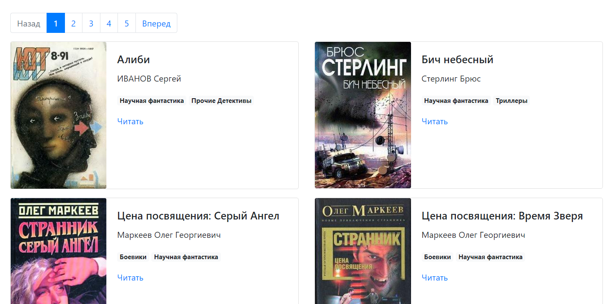

# Парсер книг с сайта tululu.org
Этот проект создан для того, чтобы вы могли скачивать книги с онлайн-библиотеки [tululu.org](https://tululu.org/).

## Как установить

Python3 должен быть уже установлен. Затем используйте `pip` (или `pip3`, есть есть конфликт с Python2) для установки зависимостей:
```
pip install -r requirements.txt
```

И вот вы уже можете запустить этот проект!


## Пример запуска скриптов

Вот пример для того, чтобы скачать первые 10 книг с сайта:

```
python library.py
```

А вот пример скачивания всех страниц (1-701) с книгами научной фантастики:
```
python parse_tululu_category.py
```

Пример для генерации страниц на основе скачанных данных с прошлых файлов, он запускается самым последним, в другой последовательности он не будет работать:
```
python render_website.py
```

## Дополнение 
Также, есть несколько необязательных дополнений, чтобы улучшить функционал проекта, просто напишите в командной строке к названию файла `--help`:

1. Для файла `library.py`:

    ```
    python library.py --help
    ```
    В этом файле есть два аргумента, которые Вы можете дополнить: 

        1. `--start_id` (С книги с каким ID вы хотите начать цикл скачивания)
        2. `--end_id` (С книги с каким ID вы хотите закончить цикл скачивания)

    Например:

    ```
    python library.py --start_id 20(любое его значение) --end_id 30(любое его значение)
    ```

    Это необязательно, есть default-значения, которые скачают с 1-й по 10-ю книгу.

2. Для файла `parse_tululu_category.py`:

    ```
    python library.py --help
    ```
    В этом файле есть два аргумента, которые Вы можете дополнить: 

        1. `--start_page` (С какой страницы начинать скачивание)
        2. `--end_page` (С какой страницы закончить скачивание)
        3. `--skip_txt` (Пропустить скачивание текста книг или нет. Если пропустить - напишите 'skip', в ином случае не вводите параметр)
        4. `--skip_img` (Пропустить скачивание картинки книг или нет. Если пропустить - напишите 'skip', в ином случае не вводите параметр)
        5. `--dest_folder` (Название общей папки для текста книг, их картинок и json-файла с параметрами книги)

    Например:

    ```
    python library.py --start_page 20(Любое его значение) --end_page 30(Любое его значение) --skip_txt skip(Либо не вводим) --skip_img skip(Либо не вводим) --dest_folder books_info(Любое название)
    ```

    Каждый из параметров необязательный, если ничего не указать, скачаются ВСЕ страницы научной фантастики

    После запуска файла будет создан файл `.env` с нужной информацией для запуска `render_website.py`. НЕ УДАЛЯЙТЕ его для продолжения работы.

3. Для файла `render_website.py`:

    После его запуска, на ваш компьютер сохранятся страницы библиотеки со скачанными уже книгами.

    После запуска сайте на компьютере, нужно перейти по [ссылке на ваш локальный сервер](http://127.0.0.1:5500/pages/index1.html)

    Также, страницы можно открыть через браузер, перейдя на любую страницу через папку `pages`.


    Например, сайт может выглядеть [так](https://nik-olaso.github.io/online-library/pages/index1.html):
   
   
    

    Чтобы скачать только книгу, которую вы хотите, не скачивая код, вам нужно:

        1. Перейти на сайт по ссылке выше
        
        2. Выбрать нужную книгу из списка

        3. Нажать на кнопку читать

        4. Скачать файл на который вы перешли
    

    Всю статику такую как bootstrap, javascript и картинки код берет из папки `static` 

    А все данные для размещения книг на странице код берет из папки `all_folders`, оттуда достаются и книги, и их картинки, и даже json-файл со всеми данными про книгу


## Цель проекта
Код написан в образовательных целях на онлайн-курсе для веб-разработчиков [dvmn.org](https://dvmn.org/).
